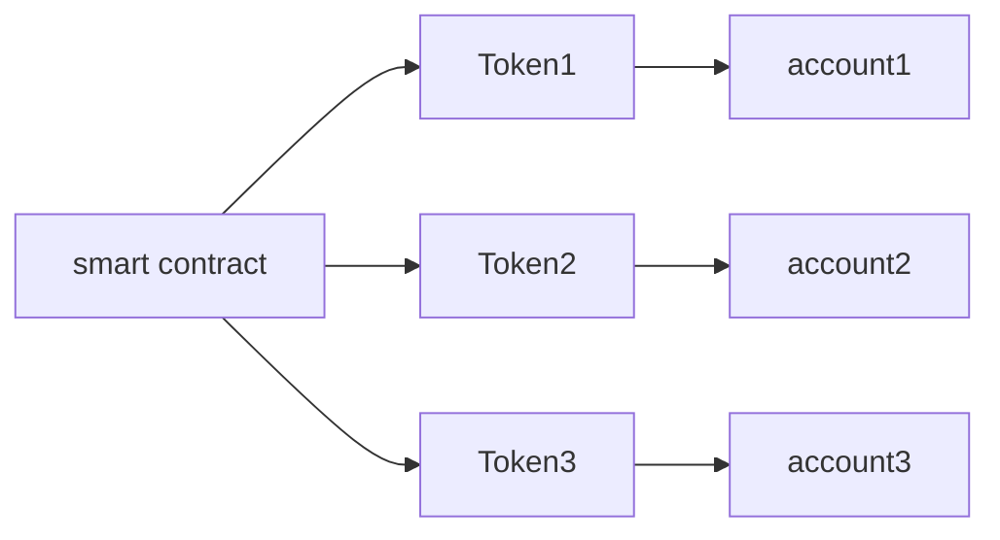
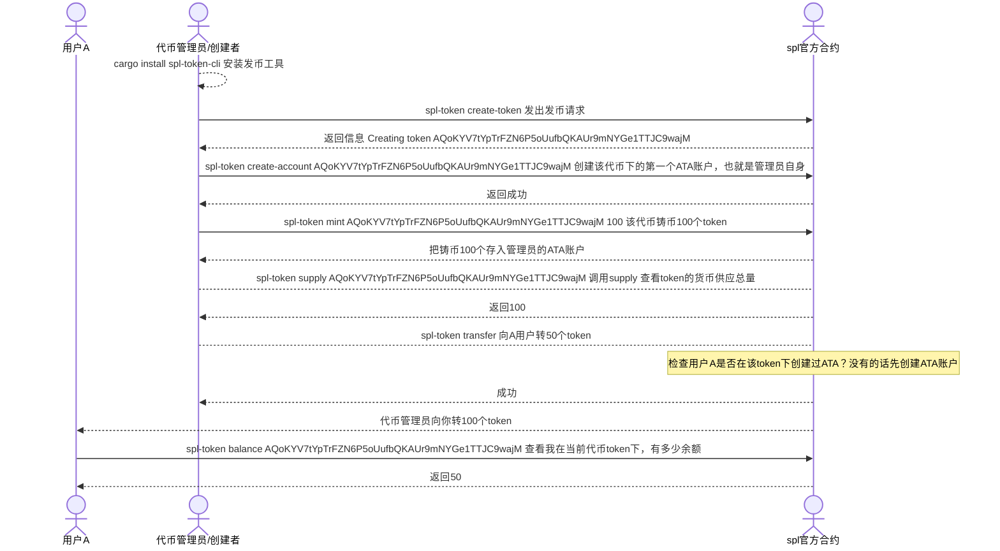
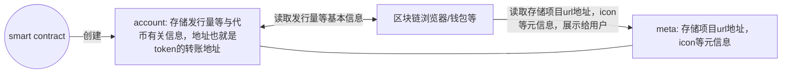
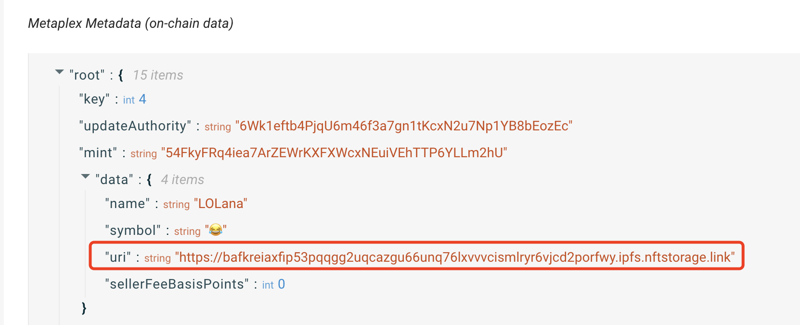
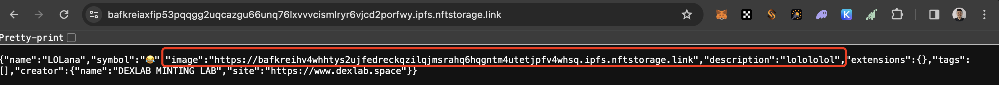
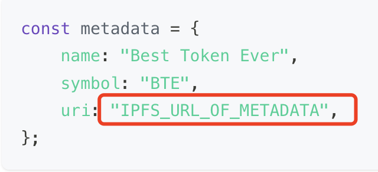
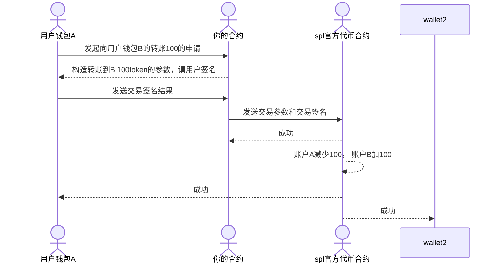

# 如何使用solana发币
The SPL is similar to the Ethereum Request for Communication (ERC) standard on Ethereum。

基本上solana已经给你提供好了发币的代码，你什么都不需要做，只需要输入命令即可，一键发币。如果是在以太坊发币，你需要继承自ERC20协议的接口，并自己写函数。但是在solana里，你什么都不需要做，接口等等都写好了。你只需要提供币的名称等就行。

[Token Program | Solana Program Library Docs](https://spl.solana.com/token#example-create-a-non-fungible-token)

如果你不喜欢使用Solana提供的发币代码，你也可以通过api直接创建。当然就显得很麻烦

在以太坊中，变量和程序在一起，没有做很好地区分。也就是说，如果你的变量变了，你必须要重新发合约。

但是在solana中，变量和程序是分开的，官方已经全部写好发币的合约并发布该程序。你只需要创建不同的变量，也就是account即可。缺点定制化程度低，好处在于简单，啥都不用管。**类似于类与对象的关系**

你可以把sol当成一个特殊的token。优先级比普通token高



当然，下面的所有流程，官方的spl-token即可完成（唯独不支持设置metadata）

发币和转账的时序图如下。直接用官方的spl-token工具即可



# 创建TOKEN API

solana的官方文档中，已经给了一个使用spl例子发币的代码。

tokens/create-token/native/program/src/lib.rs

整个的流程图大概类似于这样。本质而言，还是使用官方代码创建。自由度略低



对应这个

Steps to Create an SPL Token

1. Create an account for the Mint.
2. Initialize that account as a Mint Account.
3. Create a metadata account associated with that Mint Account.

官方的rust代码基本没什么用，反正都导出api了，建议使用quicknode的代码，快速发币

[How to Create a Fungible SPL Token on Solana with Metaplex | QuickNode](https://www.quicknode.com/guides/solana-development/spl-tokens/how-to-create-a-fungible-spl-token-with-the-new-metaplex-token-standard)

### 注意事项

需要注意的是，如果想要展示项目其他信息,例如简介等等，metadata只支持三个信息，name，symbol，uri。你需要把你的其他信息塞入uri里并返回json。类似下面







在主网上发一次币的成本大概是0.2sol左右。具体看情况。

# mint

这玩意就类似于铸币，凭空产生币

首先我们需要了解一下什么是ATA账户

### [associated token account (ATA)](https://www.alchemy.com/overviews/associated-token-account)

所以，首先判断是否有ATA地址？没有的话先给他创建一个。当然，钱包等都会遵守的。不需要你管。ATA有点类似于身份证和银行账户的关系。即你去不同的银行开户，通过身份证给你开一个银行账户。不同的银行，账户也各不相同。我们可以把ATA类比为银行账户

然后调用去mint即可

```
token_instruction::mint_to(
            token_program.key,
            mint_account.key,
            associated_token_account.key,
            mint_authority.key,
            &[mint_authority.key],
            args.quantity,
        )
```

这个api说明可以参考这里

[TokenInstruction in spl_token::instruction - Rust](https://docs.rs/spl-token/latest/spl_token/instruction/enum.TokenInstruction.html#variant.MintTo)

# 转账 Transfer

调用Transfer指令即可

```rust
token_instruction::transfer(
            token_program.key,
            from_associated_token_account.key,
            to_associated_token_account.key,
            owner.key,
            &[owner.key, recipient.key],
            args.quantity,
        )
```

from是转出地址，to是转入地址，需要owner的公钥才可以操作。但是anchor的api，明显更简洁

```rust

    // Invoke the transfer instruction on the token program
    transfer(
        CpiContext::new(
            ctx.accounts.token_program.to_account_info(),
            Transfer {
                from: ctx.accounts.sender_token_account.to_account_info(),
                to: ctx.accounts.recipient_token_account.to_account_info(),
                authority: ctx.accounts.sender.to_account_info(),
            },
        ),
        amount * 10u64.pow(ctx.accounts.mint_account.decimals as u32), // Transfer amount, adjust for decimals
    )
```

只需要一个from，to，amount，即可完成操作

参考

https://www.quicknode.com/guides/solana-development/spl-tokens/how-to-transfer-spl-tokens-on-solana

既然遵守SPL协议，所以钱包也可以直接调用这个instruction即可。

假如你是通过自己的合约部署的spl协议。下图讲解一下如何转账的流程



# Burn 烧币

类似于mint凭空产生币，Burn是凭空消失币

[How to Burn SPL Tokens on Solana | QuickNode](https://www.quicknode.com/guides/solana-development/spl-tokens/how-to-burn-spl-tokens-on-solana)

都是指令，不再赘述。

# Wrapped sol

在Solana区块链上，"wrapped SOL"（W-SOL）是Solana网络中的一种代币，通常用于表示 Solana 的原生代币 SOL（Solana）。"Wrapped" 一词通常用来描述一种代币，它意味着将某个原生代币（在这种情况下是 SOL）锁定在一个智能合约中，然后在其他区块链上创建一个新的代币，该代币与原生代币具有一定的锚定关系。这使得原生代币能够在其他区块链上进行更广泛的使用和流动性。

在 Solana 上，W-SOL 是由一个智能合约（通常称为桥）所管理的，用户可以将他们的 SOL 存入该智能合约，然后获得相应数量的 W-SOL。这些 W-SOL 可以在 Solana 区块链上进行交易，同时也可以通过桥回兑回原生的 SOL。这种机制使得 Solana 上的 SOL 能够在其他区块链上进行交易和使用，从而增加了其流动性和跨链功能。

# FAQ

1. 如何理解创建token中的，Mint account和Mint authority account

[Understanding Solana’s Mint Accounts and Token Accounts](https://medium.com/@jorge_londono_31005/understanding-solanas-mint-account-and-token-accounts-546c0590e8e)

Mint account，其实也就是代币的地址，也就是刚才创建的account的地址。Mint authority account也就是owner

1. 只要你是基于spl协议，那么你的钱包一定可以链接到你的token
