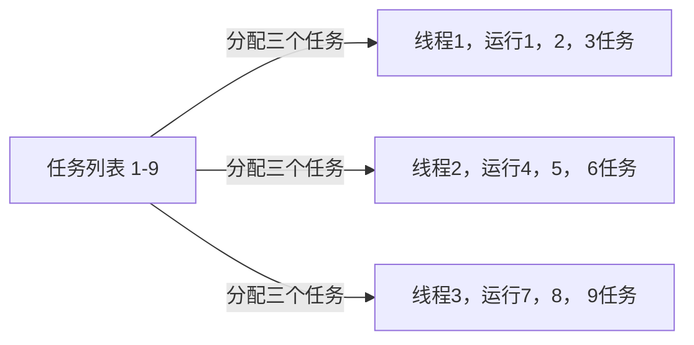
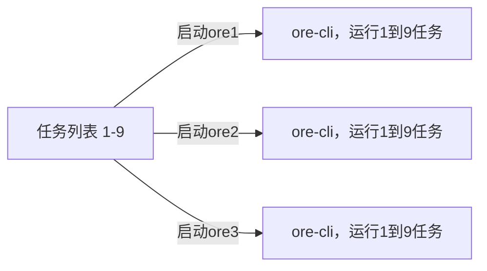
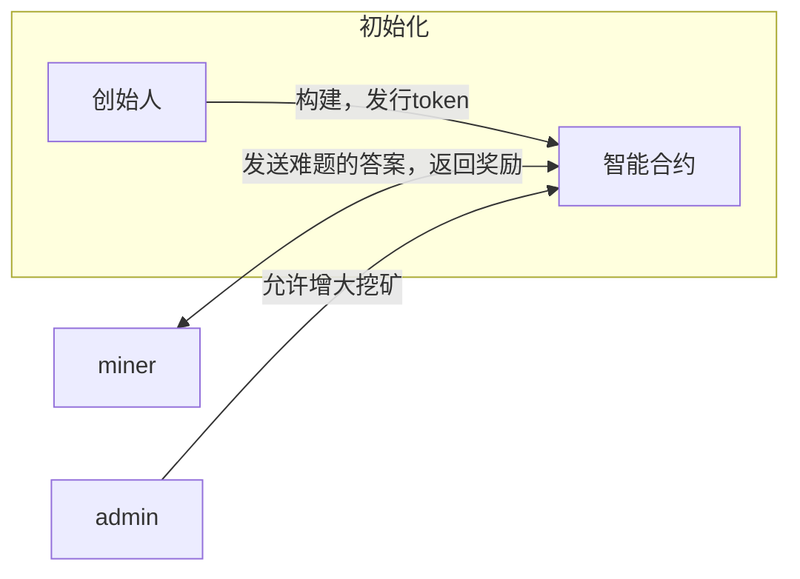

Ore挖矿快速问答
## 1. 安装挖矿程序
如何开始挖矿，首先你要安装solana的全家桶。

ore-cli的参数如下

```
➜  release git:(master) ✗ ./ore                                                                           
A command line interface for the Ore program.

Usage: ore [OPTIONS] <COMMAND>

Commands:
  balance   Fetch the Ore balance of an account
  busses    Fetch the distributable rewards of the busses
  mine      Mine Ore using local compute
  claim     Claim available mining rewards
  rewards   Fetch your balance of unclaimed mining rewards
  treasury  Fetch the treasury account and balance
  help      Print this message or the help of the given subcommand(s)

Options:
      --rpc <NETWORK_URL>             Network address of your RPC provider
  -C, --config <PATH>                 Filepath to config file.
      --keypair <KEYPAIR_FILEPATH>    Filepath to keypair to use
      --priority-fee <MICROLAMPORTS>  Number of microlamports to pay as priority fee per transaction [default: 0]
  -h, --help                          Print help
  -V, --version                       Print version
```

### 1. 安装ore-cli挖矿程序
   cargo install ore-cli
### 2. 运行挖矿
```
ore \

--rpc 你的rpc节点，可以是付费的，注意一定是http \

--keypair <KEYPAIR_FILEPATH> 你的密钥存放位置，默认一般是 \

--priority-fee <MICROLAMPORTS> \

mine \

--threads <TRHEAD_COUNT>
```

给一个参考的命令
```
ore --rpc https://api.mainnet-beta.solana.com  --keypair ~/.config/solana/id.json --priority-fee 2 mine --threads 4
```
## 2. 查看账户余额

当然如果你当前账户没有token，会提示报错的。命令的要点是banlane参数。rpc与keypair都是固定参数，与挖矿类似
```
➜  release git:(master) ✗ ./ore --rpc https://api.mainnet-beta.solana.com   --keypair ~/.config/solana/id.json balance 
Error { request: None, kind: RpcError(ForUser("Account could not be parsed as token account: pubkey=GHfu35mGXLPo6RkTcrZVULAUENCUlnxuew")) }
```

## 3. 如何查看当前挖矿难度，管理员等
使用treasury命令
命令以及执行结果如下
```
➜  release git:(master) ✗ ./ore --rpc https://api.mainnet-beta.solana.com   --keypair ~/.config/solana/id.json  treasury
1294.259345804 ORE
Admin: tHCCE3KWKx8i8cDjX2DQ3Z7EMJkScAVwkfxdWz8SqgP 管理员账号
Difficulty: 1113x9WdeZEvnHZEiSj3nnYxbKGrFmiYj1PYpNa5hFc 当前难度，你生成的hash要大与Difficulty的hash
Last reset at: 1712412761
Reward rate: 0.000178762 ORE
Total claimed rewards: 4311.564531943 ORE 
```
## 4. 如何领取挖矿后的奖励
在挖矿成功后，ore在账本上记录你应该有多少token。需要你自行领取.
claim命令
命令如下
```
 ./ore --rpc https://api.mainnet-beta.solana.com   --keypair ~/.config/solana/id.json  claim  
```

## 5. 如何查询你还有多少token未领取
使用rewards
```
➜  release git:(master) ✗ ./ore --rpc https://api.mainnet-beta.solana.com   --keypair ~/.config/solana/id.json  rewards
0 ORE
```

# FAQ：

## 1. Ore挖矿是否支持分布式挖矿？

答案是可以的，在ore-cli程序中，看到了多线程分配任务的代码。

```rust
std::thread::spawn({
      let found_solution = found_solution.clone();
      let solution = solution.clone();
      let mut stdout = stdout();
      move || {
          let n = u64::MAX.saturating_div(threads).saturating_mul(i);
          let mut next_hash: KeccakHash;
          let mut nonce: u64 = n;
          loop {
              next_hash = hashv(&[
                  hash.to_bytes().as_slice(),
                  pubkey.to_bytes().as_slice(),
                  nonce.to_le_bytes().as_slice(),
              ]);
```

从0到u64的最大值，按照线程开启的数量，有序分配任务。

但是ore的官方程序目前不支持多进程，分布式挖矿。因为ore没有实现rpc的通信。

也就是说，每个节点因为没有同步nonce的状态，所以每个节点都是从头开始挖矿，这样失去了多节点挖矿的意义，而且还会消耗无谓的cpu。所以目前多开ore程序挖矿，其实没有任何意义。当然，关注我的github，后续会推出多节点挖矿方式。

一图以说明情况

ore多线程，有序挖矿



你以为的多开ore挖矿，互相之间不清楚任务进度，盲目浪费cpu



## 2. 究竟什么样的设备可以挖矿？

根据代码中描述，ore的挖矿主要计算keccak算法，所以，ore挖矿主要吃cpu性能，目前暂时没有出现显卡挖矿方式。如果ore价格居高不下，或许有可能出现使用gpu挖矿的程序

所以，你的挖矿电脑性能越高，越容易出块～

## 3. 是否真的需要一台国外的vps去挖矿？

答案是否定的，让我们来看下图，模拟一次完整的挖矿流程


问题的重点在于，你的挖矿程序因为很多原因，很难顺利地solana的rpc节点。所以解决这个问题的方法是

1. 购买付费rpc，例如quicknode
2. 自建rpc，费用过高
3. 使用proxy代理，去链接solana的rpc

我们在这里重点讲解一下ore-cli如何使用代理

ore-cli挖矿程序使用solana-client这个包去发送rpc请求。solana-client在底层使用reqwest包构造http请求。

但是solana-client的api调用中，没有任何地方提供输入proxy的参数。所以我们需要查看reqwest包。

在reqwest包中，如果检测到存在代理有关的环境变量，那么自动加载环境变量设置的代理，代码如下

```rust
        let mut proxies = config.proxies;
        if config.auto_sys_proxy {
            proxies.push(Proxy::system());
        }
        let proxies = Arc::new(proxies);

```

但是需要注意的是，这里只支持http和https的代理，不支持socks5！！！

使用方法：在终端中设置代理即可

```python
export https_proxy=http://127.0.0.1:7890 
export http_proxy=http://127.0.0.1:7890

```

## 4. 我的rpc不稳定怎么办

在solana-client包中，如果与rpc节点交互失败，一般会重试五次，每次会随机sleep。

```python
let mut too_many_requests_retries = 5;
```

## 5. Ore挖矿和比特币挖矿一样吗？

答案是不一样的。

比特币挖矿，是为了将网络中的交易，通过增加记账难度，让交易记录变得不可篡改。

而Ore挖矿，纯属玩你。

你可以理解为，只有在解出特定的难题后，智能合约才会给你airdrop。



## 6. Ore挖矿为什么要预存？

因为你要调用智能合约，验证你的hash是否正确。而这个过程中，谁调用合约谁需要支付费用。

## 7. 为什么提示Transaction did not land
错误信息类似于这样
```
Transaction did not land
Attempt: 4
3fY9twx3b2bvWq4qomWVG5q3FtJ2C7MRS1j3UYdtepiGCca2KXB1rCRhKXwfAQHBfjujHJxHtBYwiZ9YW6Ja59DV
Confirms: [None, None, None, None, None]
Confirms: [None, None, None, None, None]
Confirms: [None, None, None, None, None]
Confirms: [None, None, None, None, None]
Transaction did not land
thread 'main' panicked at src/register.rs:22:14:
Transaction failed: Error { request: None, kind: Custom("Max retries") }
note: run with RUST_BACKTRACE=1 environment variable to display a backtrace
```
恭喜你，你成功的把sol链弄拥堵了，没办法，只能等待。
