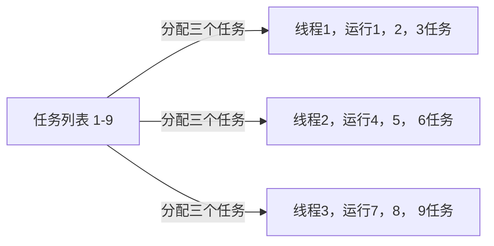
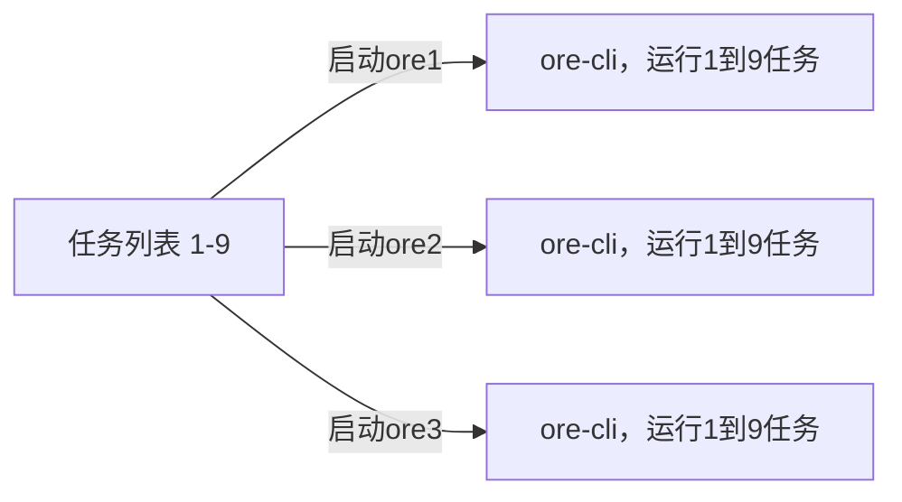
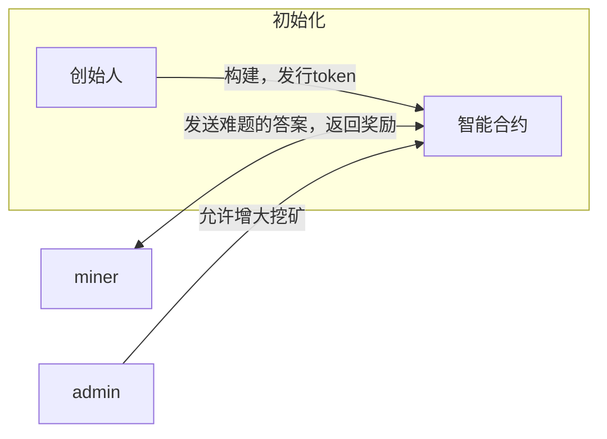

# Ore挖矿快速问答

# 1. Ore挖矿是否支持分布式挖矿？

答案是可以的，在ore-cli程序中，看到了多线程分配任务的代码。

```rust
std::thread::spawn({
      let found_solution = found_solution.clone();
      let solution = solution.clone();
      let mut stdout = stdout();
      move || {
          let n = u64::MAX.saturating_div(threads).saturating_mul(i);
          let mut next_hash: KeccakHash;
          let mut nonce: u64 = n;
          loop {
              next_hash = hashv(&[
                  hash.to_bytes().as_slice(),
                  pubkey.to_bytes().as_slice(),
                  nonce.to_le_bytes().as_slice(),
              ]);
```

从0到u64的最大值，按照线程开启的数量，有序分配任务。

但是ore的官方程序目前不支持多进程，分布式挖矿。因为ore没有实现rpc的通信。

也就是说，每个节点因为没有同步nonce的状态，所以每个节点都是从头开始挖矿，这样失去了多节点挖矿的意义，而且还会消耗无谓的cpu。所以目前多开ore程序挖矿，其实没有任何意义。当然，关注我的github，后续会推出多节点挖矿方式。

一图以说明情况

ore多线程，有序挖矿



你以为的多开ore挖矿，互相之间不清楚任务进度，盲目浪费cpu



# 2. 究竟什么样的设备可以挖矿？

根据代码中描述，ore的挖矿主要计算keccak算法，所以，ore挖矿主要吃cpu性能，目前暂时没有出现显卡挖矿方式。如果ore价格居高不下，或许有可能出现使用gpu挖矿的程序

所以，你的挖矿电脑性能越高，越容易出块～

### 3. 是否真的需要一台国外的vps去挖矿？

答案是否定的，让我们来看下图，模拟一次完整的挖矿流程


问题的重点在于，你的挖矿程序因为很多原因，很难顺利地solana的rpc节点。所以解决这个问题的方法是

1. 购买付费rpc，例如quicknode
2. 自建rpc，费用过高
3. 使用proxy代理，去链接solana的rpc

我们在这里重点讲解一下ore-cli如何使用代理

ore-cli挖矿程序使用solana-client这个包去发送rpc请求。solana-client在底层使用reqwest包构造http请求。

但是solana-client的api调用中，没有任何地方提供输入proxy的参数。所以我们需要查看reqwest包。

在reqwest包中，如果检测到存在代理有关的环境变量，那么自动加载环境变量设置的代理，代码如下

```rust
        let mut proxies = config.proxies;
        if config.auto_sys_proxy {
            proxies.push(Proxy::system());
        }
        let proxies = Arc::new(proxies);

```

但是需要注意的是，这里只支持http和https的代理，不支持socks5！！！

使用方法：在终端中设置代理即可

```python
export https_proxy=http://127.0.0.1:7890 
export http_proxy=http://127.0.0.1:7890

```

# 4. 我的rpc不稳定怎么办

在solana-client包中，如果与rpc节点交互失败，一般会重试五次，每次会随机sleep。

```python
let mut too_many_requests_retries = 5;
```

# 5. Ore挖矿和比特币挖矿一样吗？

答案是不一样的。

比特币挖矿，是为了将网络中的交易，通过增加记账难度，让交易记录变得不可篡改。

而Ore挖矿，纯属玩你。

你可以理解为，只有在解出特定的难题后，智能合约才会给你airdrop。



# 6. Ore挖矿为什么要预存？

因为你要调用智能合约，验证你的hash是否正确。而这个过程中，谁调用合约谁需要支付费用。
