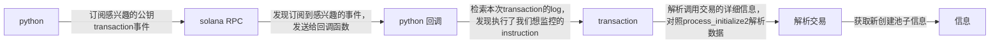

该工具用来监控Solana Raydium上新的代币信息。
为了更稳定，建议使用的时候修改RPC node
NewlyCreatedPairs.py的第34 35行

使用pip install -r requirements.txt安装依赖

运行python NewlyCreatedPairs.py

> 注意，不保证获取token的metadata实时可用。但目前而言，已经足够稳定了


# 订阅新池子的信息的原理

核心api 

https://solana.com/docs/rpc/websocket/logssubscribe 

流程图



```
============NEW POOL DETECTED====================
 Token_Index     │ Account Public Key 
                 |
 Token0          │ 8NcwK9XRhq1JGbjiouyYGbA1fxqNgpYDmMGYVvnfVBhm 
 Token1          │ So11111111111111111111111111111111111111112 
 LP Pair         │ GsWScZRK9r63my8S8c1q7R6fExkP7zUGPCyT1kX4TGuM 
Token metadata:
{
    "success": true,
    "data": {
        "lamports": 1461600,
        "ownerProgram": "TokenkegQfeZyiNwAJbNbGKPFXCWuBvf9Ss623VQ5DA",
        "type": "token_account",
        "rentEpoch": 18446744073709552000,
        "executable": false,
        "isOnCurve": true,
        "account": "8NcwK9XRhq1JGbjiouyYGbA1fxqNgpYDmMGYVvnfVBhm",
        "tokenInfo": {
            "name": "Trump Hair",
            "symbol": "Trump Hair",
            "icon": "https://arweave.net/xM5SGujbrSBx4MX3kmIcMogxqgt9hT9Qa0ZjSCPcPPM",
            "decimals": 9,
            "tokenAuthority": "5RJ3YKgT52o87CvmqTeLmasJvbb7V4ZDoY6LQ2cj9vPM",
            "freezeAuthority": null,
            "supply": "9900000000000000000",
            "type": "token_address"
        },
        "metadata": {
            "key": 4,
            "updateAuthority": "5RJ3YKgT52o87CvmqTeLmasJvbb7V4ZDoY6LQ2cj9vPM",
            "mint": "8NcwK9XRhq1JGbjiouyYGbA1fxqNgpYDmMGYVvnfVBhm",
            "data": {
                "name": "Trump Hair",
                "symbol": "Trump Hair",
                "uri": "https://arweave.net/8qzYSubnN3cdtMHnQXqVXDOrJ19r73bgTWr3UkbiEZg",
                "sellerFeeBasisPoints": 0
            },
            "primarySaleHappened": 0,
            "isMutable": 1,
            "editionNonce": 255,
            "tokenStandard": 2
        }
    }
}
True, https://solscan.io/tx/537tcnMw5FHH74WcC8uXmJ5rdgwqTzjtYuNM73AEK3KuDeRDZtpfTpPJXzJFLYHRZyv8pL2DqCPtCfCxtW4ebPHQ
============NEW POOL DETECTED====================
 Token_Index     │ Account Public Key 
                 |
 Token0          │ 8NcwK9XRhq1JGbjiouyYGbA1fxqNgpYDmMGYVvnfVBhm 
 Token1          │ So11111111111111111111111111111111111111112 
 LP Pair         │ GsWScZRK9r63my8S8c1q7R6fExkP7zUGPCyT1kX4TGuM 
Token metadata:
{
    "success": true,
    "data": {
        "lamports": 1461600,
        "ownerProgram": "TokenkegQfeZyiNwAJbNbGKPFXCWuBvf9Ss623VQ5DA",
        "type": "token_account",
        "rentEpoch": 18446744073709552000,
        "executable": false,
        "isOnCurve": true,
        "account": "8NcwK9XRhq1JGbjiouyYGbA1fxqNgpYDmMGYVvnfVBhm",
        "tokenInfo": {
            "name": "Trump Hair",
            "symbol": "Trump Hair",
            "icon": "https://arweave.net/xM5SGujbrSBx4MX3kmIcMogxqgt9hT9Qa0ZjSCPcPPM",
            "decimals": 9,
            "tokenAuthority": "5RJ3YKgT52o87CvmqTeLmasJvbb7V4ZDoY6LQ2cj9vPM",
            "freezeAuthority": null,
            "supply": "9900000000000000000",
            "type": "token_address"
        },
        "metadata": {
            "key": 4,
            "updateAuthority": "5RJ3YKgT52o87CvmqTeLmasJvbb7V4ZDoY6LQ2cj9vPM",
            "mint": "8NcwK9XRhq1JGbjiouyYGbA1fxqNgpYDmMGYVvnfVBhm",
            "data": {
                "name": "Trump Hair",
                "symbol": "Trump Hair",
                "uri": "https://arweave.net/8qzYSubnN3cdtMHnQXqVXDOrJ19r73bgTWr3UkbiEZg",
                "sellerFeeBasisPoints": 0
            },
            "primarySaleHappened": 0,
            "isMutable": 1,
            "editionNonce": 255,
            "tokenStandard": 2
        }
    }
}
True, https://solscan.io/tx/537tcnMw5FHH74WcC8uXmJ5rdgwqTzjtYuNM73AEK3KuDeRDZtpfTpPJXzJFLYHRZyv8pL2DqCPtCfCxtW4ebPHQ

```
